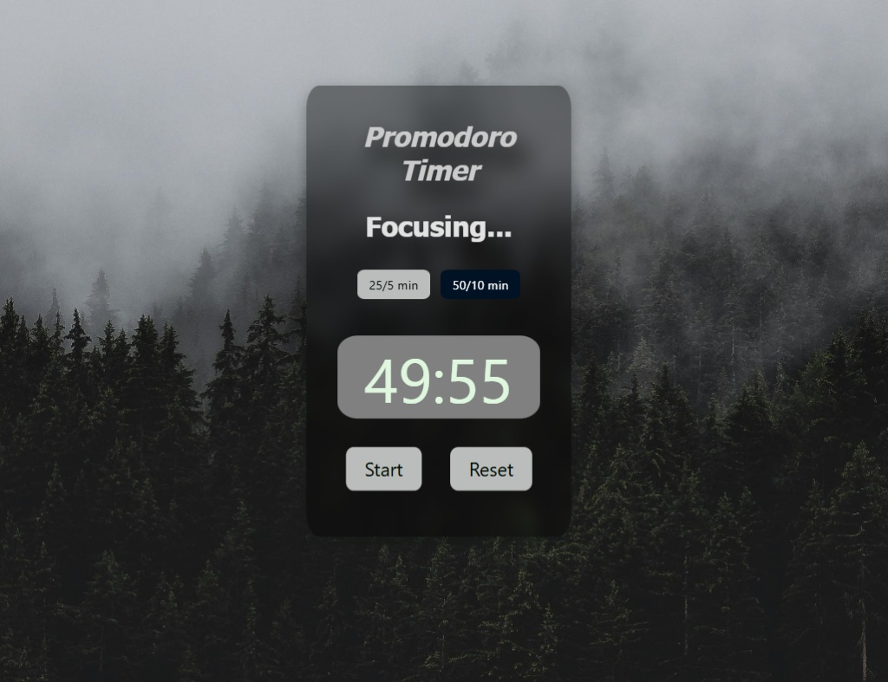

# Focus - Pomodoro Timer

A simple, aesthetically pleasing web-based Pomodoro timer designed to help you stay focused and manage your work sessions effectively. This application features a glassmorphism UI and allows users to switch between standard Pomodoro intervals and extended work sessions.



## Features

* **Dual Modes:** Switch easily between two focus intensities:
    * **25/5 min:** Standard Pomodoro interval (25 minutes).
    * **50/10 min:** Extended deep work session (50 minutes).
* **Visual Countdown:** Large, clear digital display showing minutes and seconds.
* **Status Updates:** Dynamic text indicating the current state (e.g., "Ready", "Focusing...", "Time's Up!").
* **Control:** Simple Start and Reset functionality.
* **Aesthetic UI:** Features a semi-transparent "glass" effect (`backdrop-filter`) over an immersive background.

## Technologies Used

* **HTML5:** Semantic structure.
* **CSS3:** Styling including absolute positioning, z-indexing for backgrounds, and CSS variables.
* **JavaScript (Vanilla):** DOM manipulation, `setInterval` for timing logic, and event handling.

## Setup & Usage

1.  **Download:** Ensure you have `Index.html`, `style.css`, and `script.js` in the same directory.
2.  **Assets:** Create a folder named `imgs` and place your background image inside it named `background.jpg` (or update the CSS to point to your preferred image).
3.  **Run:** Open `Index.html` in any modern web browser.

## Project Structure

```text
.
├── Index.html      # Main markup
├── style.css       # Styling and glassmorphism effects
├── script.js       # Timer logic and DOM manipulation
└── imgs/
    └── background.jpg  # Background image